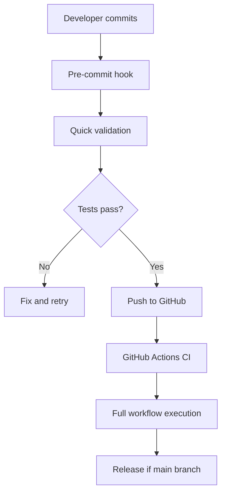

# Workflow Testing Documentation

This directory contains tools and documentation for testing GitHub Actions workflows locally using `act`.

## Overview

Our CI/CD pipeline includes comprehensive testing capabilities that allow developers to validate GitHub Actions workflows locally before pushing to GitHub. This ensures faster feedback loops and reduces failed builds in CI.

## Directory Structure

```
tests/workflows/
├── README.md                    # This documentation
├── test-workflows.sh           # Comprehensive workflow testing script
├── quick-test.sh               # Quick validation tests
├── setup-act.sh                # Setup script for act environment
└── examples/                   # Example workflows and test cases
```

## Available Scripts

### 1. **test-workflows.sh** - Main Testing Script

Comprehensive testing tool that supports multiple testing modes:

```bash
# Test all workflows (recommended)
npm run test:workflows

# Test specific components
./tests/workflows/test-workflows.sh ci          # CI workflow only
./tests/workflows/test-workflows.sh release     # Release workflow only
./tests/workflows/test-workflows.sh validate    # YAML syntax validation only
./tests/workflows/test-workflows.sh deps        # Dependency checking only
./tests/workflows/test-workflows.sh perf        # Performance testing
```

**Features:**

- YAML syntax validation with multiple validators (js-yaml, Python YAML)
- Dependency checking (act, Docker)
- Workflow structure validation
- Performance benchmarking
- Colored output with progress indicators
- Comprehensive error handling and cleanup

### 2. **quick-test.sh** - Quick Validation

Fast validation script for pre-commit checks:

```bash
npm run test:quick
```

**What it validates:**

- ✅ YAML syntax correctness
- ✅ Workflow structure (jobs, steps, triggers)
- ✅ Required fields present
- ⚡ Runs in <5 seconds

### 3. **setup-act.sh** - Environment Setup

One-time setup script for configuring the act testing environment:

```bash
./tests/workflows/setup-act.sh
```

**What it sets up:**

- act configuration files (`.actrc`, `.secrets`)
- Docker image pulling
- NPM testing scripts
- Documentation generation

## Workflow Testing Strategy

### 1. **Multi-Level Validation**

Our testing approach uses multiple validation levels:

**Level 1: Syntax Validation**

- YAML syntax checking
- GitHub Actions schema validation
- Required field presence

**Level 2: Structure Validation**

- Job dependency validation
- Matrix strategy verification
- Event trigger correctness

**Level 3: Execution Testing** (Limited)

- Basic workflow execution with act
- Environment variable testing
- Shell command validation

**Level 4: Integration Testing** (Manual)

- Full workflow execution on GitHub
- Real dependency installation
- Actual NPM publishing (dry-run)

### 2. **Offline-First Approach**

Most tests run offline to ensure developer productivity:

```bash
# These work without internet:
npm run test:quick              # ✅ Offline
./test-workflows.sh validate    # ✅ Offline
./test-workflows.sh deps        # ✅ Offline

# These require Docker/internet:
./test-workflows.sh ci          # ⚠️  Requires Docker + internet
./test-workflows.sh release     # ⚠️  Requires Docker + internet
```

## act Testing Limitations

### What Works with act ✅

- **Basic workflow execution** - Shell commands, environment variables
- **Workflow syntax validation** - YAML parsing, job structure
- **Event simulation** - push, pull_request, workflow_dispatch
- **Environment testing** - Docker containers, basic tooling
- **Simple validation workflows** - File operations, exit codes

### What Doesn't Work with act ❌

- **External GitHub Actions** - Requires authentication/internet

  ```yaml
  # This fails with act:
  - uses: actions/setup-node@v4 # ❌ External action

  # This works with act:
  - run: node --version # ✅ Direct command
  ```

- **GitHub-specific features** - Secrets, GITHUB_TOKEN, artifacts upload
- **NPM registry operations** - Actual publishing, audit signatures
- **Complex dependencies** - Multi-stage builds, external services

### act Testing Strategy

Given these limitations, our strategy is:

1. **Use act for basic validation** - Syntax, structure, basic execution
2. **Use GitHub for full integration** - Complete CI/CD pipeline testing
3. **Optimize for fast feedback** - Most validation happens locally

## Continuous Integration Workflow

Our CI/CD testing follows this pattern:



**Local Testing Commands:**

```bash
# Pre-commit validation
npm run test:quick

# Pre-push validation
npm run test:workflows

# Full local testing (if Docker available)
npm run test:ci-local
```

## Testing Real Workflows

### CI Workflow Testing

```bash
# Validate CI workflow structure
npm run test:ci-local

# What gets tested:
# ✅ YAML syntax
# ✅ Job dependencies (quality-gates needs test)
# ✅ Matrix strategy (Node 18, 20, 22)
# ⚠️  Limited: actual npm/TypeScript execution
```

### Release Workflow Testing

```bash
# Test release workflow in dry-run mode
npm run test:release-local

# What gets tested:
# ✅ Dry-run input handling
# ✅ Conditional job execution
# ✅ Semantic-release configuration
# ⚠️  Limited: no actual NPM publishing
```

## Troubleshooting

### Common Issues

**1. "act command not found"**

```bash
# Install act
brew install act
# or
curl -s https://raw.githubusercontent.com/nektos/act/master/install.sh | bash
```

**2. "Docker not running"**

```bash
# Start Docker Desktop
open /Applications/Docker.app
# or start Docker daemon
sudo systemctl start docker
```

**3. "Permission denied" on scripts**

```bash
# Make scripts executable
chmod +x tests/workflows/*.sh
```

**4. "YAML validation failed"**

```bash
# Install YAML validator
npm install -g js-yaml
# or
pip install pyyaml
```

### Debug Mode

Enable verbose output for troubleshooting:

```bash
# Debug workflow testing
DEBUG=1 ./tests/workflows/test-workflows.sh all

# Debug act execution
act --verbose push -W .github/workflows/local-test.yml
```

## Future Improvements

### Planned Enhancements

1. **Enhanced act Testing**
   - Custom Docker images with pre-installed dependencies
   - Mocked GitHub Actions for better offline testing
   - Performance optimization for large workflows

2. **Visual Testing**
   - Workflow visualization with mermaid diagrams
   - Dependency graph generation
   - Test coverage reporting

3. **Integration Testing**
   - Automated testing against real repositories
   - Performance benchmarking with realistic data
   - Cross-platform testing (Linux, macOS, Windows)

## Best Practices

### For Developers

1. **Always run quick tests before committing:**

   ```bash
   npm run test:quick && git commit
   ```

2. **Test workflows locally when possible:**

   ```bash
   npm run test:workflows
   ```

3. **Use dry-run mode for testing releases:**
   ```bash
   npm run test:release-local
   ```

### For Workflow Authors

1. **Keep workflows simple** - Minimize external dependencies
2. **Use conditional execution** - Handle both real and test environments
3. **Provide fallbacks** - Graceful degradation when tools aren't available
4. **Document limitations** - Clear comments about what requires real GitHub

## Contributing

To contribute to workflow testing:

1. **Test your changes:**

   ```bash
   npm run test:workflows
   ```

2. **Update documentation** if adding new features

3. **Follow the established patterns** for script structure and error handling

4. **Ensure cross-platform compatibility** (macOS, Linux, Windows)

---

For more information, see:

- [act documentation](https://github.com/nektos/act)
- [GitHub Actions documentation](https://docs.github.com/en/actions)
- [Project CI/CD Setup](../../docs/CI_CD_SETUP.md)
